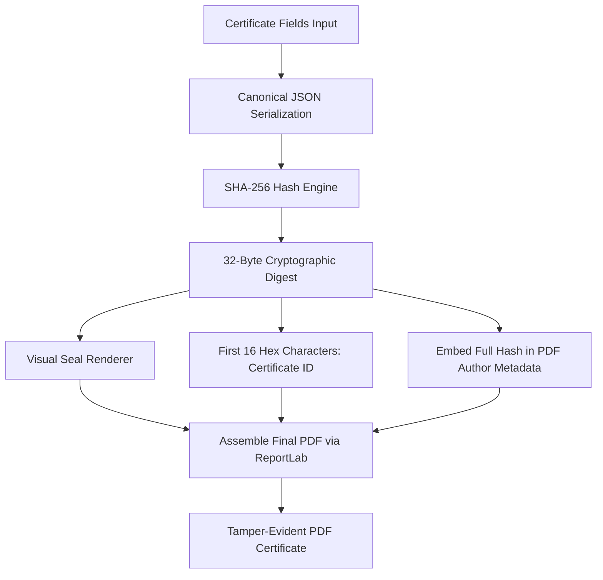
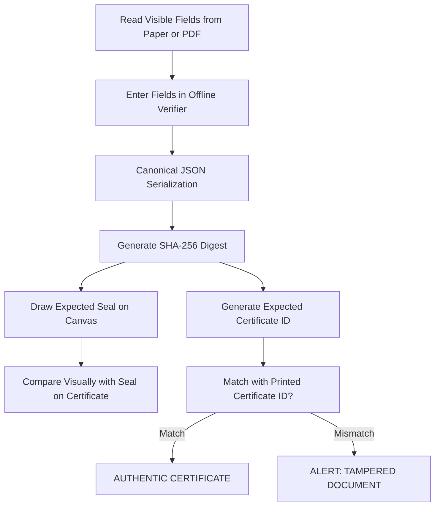

# 🎖️ PROJECT REPORT: DECENTRALIZED, OFFLINE TAMPER-EVIDENT CERTIFICATE GENERATION & VERIFICATION SYSTEM

---

## 📄 ABSTRACT

In the modern digital era, the verification of credentials, academic certificates, and official documents remains highly vulnerable to forgery and unauthorized modifications. Existing solutions either rely on centralized verification databases—which present network-dependence, single-point-of-failure risks, and data privacy leaks—or complex Public Key Infrastructures (PKI) that are difficult to implement and verify offline. 

This project presents a **Decentralized, Offline Tamper-Evident Certificate Generation and Verification System**. Utilizing the concepts of **visual cryptography** and **one-way cryptographic hash functions (SHA-256)**, the system binds credential fields deterministically to a unique, highly detailed geometric "seal". Any alteration to the certificate text (even a single character change) scrambles the underlying hash and produces a completely unrecognizable visual seal. 

This report provides the full technical specification, system architecture, visual hash byte-mapping algorithms, source code walkthroughs, security evaluations, and offline verifier implementations.

---

## 📂 TABLE OF CONTENTS
1. **Introduction & Problem Statement**
2. **System Architecture Design**
3. **Cryptographic Foundations & The Visual Hash Mapping**
4. **Module Implementation Details**
5. **Security & Cryptographic Analysis**
6. **Execution & Practical Demonstration**
7. **Future Scope & Industry Application**
8. **Conclusion**

---

## 1. INTRODUCTION & PROBLEM STATEMENT

### 1.1 The Vulnerability of Traditional Certificates
Physical and digital PDF certificates are exceptionally easy to manipulate. With modern editing software, a bad actor can alter names, courses, dates, or grades in seconds. 

### 1.2 Limitations of Existing Solutions
To combat forgery, institutions have adopted several methods, each with prominent architectural drawbacks:
1. **Centralized QR Codes / Verification Links:** 
   * *Limitation:* Requires a live internet connection to query the institution's database. If the database is down or the link expires, verification fails.
   * *Privacy Risk:* Exposes the student’s identity and credentials to network trackers or unauthorized third parties.
2. **Digital Signatures (PKI / PDF Signatures):**
   * *Limitation:* Extremely fragile when printed. Once a digitally signed PDF is printed on paper, all digital cryptographic integrity is lost.
   * *Usability:* Complex for laypersons to verify; requires certificates, trust chains, and specialized software.

### 1.3 The Proposed Solution
The **Tamper-Evident Certificate System** introduces a decentralized paradigm. It secures certificates both on-screen and on-paper without relying on active databases. It relies on a three-layer verification system:
* **Layer 1 (Visual Cryptographic Seal):** A complex color seal generated dynamically from the certificate's text fields. Works on screen and on physical paper.
* **Layer 2 (Embedded Certificate ID):** A 16-character hexadecimal verification code matching the visual seal's identity.
* **Layer 3 (Digital Self-Verification):** Embedded PDF JavaScript that automatically flags on-screen document tempering inside compliant PDF readers (e.g., Adobe Acrobat).

---

## 2. SYSTEM ARCHITECTURE DESIGN

The system follows a completely decentralized, offline verification pipeline.

### 2.1 Generation Pipeline


### 2.2 Verification Pipeline (Offline)


---

## 3. CRYPTOGRAPHIC FOUNDATIONS & THE VISUAL HASH MAPPING

The core innovation of the project is the transformation of a cryptographic hash into structured visual components.

### 3.1 Canonical Serialization
To guarantee that the hash remains identical across different platforms (Python on backend, JavaScript on frontend), the input fields are serialized into a strictly ordered canonical string.
* **Field Ordering:** Alphabetical sort of keys.
* **Format:** Compact JSON without extra whitespace.
```json
{"course": "Machine Learning Fundamentals", "date": "2026-05-12", "grade": "A+", "issued_by": "Chennai Institute of Technology", "recipient": "Arjun Sharma"}
```

### 3.2 Visual Hash Mapping (The HSL Mapping Algorithm)
The 32 bytes of the `SHA-256` digest ($d_0, d_1, \dots, d_{31}$) are mathematically mapped to specific graphic properties of the vector seal, as described in the table below:

| Byte Index | Visual Property | Mapping Formula / Logic | Description |
| :--- | :--- | :--- | :--- |
| **`d[0]`** | Background Hue | $H = d[0] / 255$ | Defines the core background tone in HSL space. |
| **`d[3]`** | Primary Hue | $H = d[3] / 255$ | Determines the main color of the outer petals. |
| **`d[3]`** | Secondary Hue | $H = (d[3] + 128) \bmod 256 / 255$ | Computes a perfect complementary color for inner petals. |
| **`d[5]`** | Accent Hue | $H = d[5] / 255$ | Color of the center dot and outer dot ring. |
| **`d[20]`** | Star Hue | $H = d[20] / 255$ | Color of the central multi-pointed star. |
| **`d[22]`** | Border Hue | $H = d[22] / 255$ | Outer ring border line color. |
| **`d[6]`** | Outer Petal Count | $N = 4 + (d[6] \bmod 9)$ | Generates between 4 and 12 distinct outer petals. |
| **`d[11]`** | Inner Petal Count | $N = 5 + (d[11] \bmod 8)$ | Generates between 5 and 12 inner petals. |
| **`d[10]`** | Radial Spoke Count | $N = 3 + (d[10] \bmod 6)$ | Defines structural spokes radiating from center (3 to 8). |
| **`d[21]`** | Star Point Count | $N = 3 + (d[21] \bmod 6)$ | Creates a central star with 3 to 8 arms. |
| **`d[9]`** | Outer Petal Radius | $R_{scale} = 0.52 + (d[9] / 255) \times 0.18$ | Expands/contracts the diameter of the outer petals. |
| **`d[8]`** | Inner Star Radius | $R_{scale} = 0.24 + (d[8] / 255) \times 0.18$ | Adjusts central star arm length. |
| **`d[7]`** | Petal Rotation | $\theta = (d[7] / 255) \times \pi$ | Tilts the outer petal ring. |
| **`d[12]`** | Spoke Rotation | $\theta = (d[12] / 255) \times \pi$ | Rotates the lines extending from center. |
| **`d[16:20]`**| Dot Ring Bitmask | $32\text{-bit int from } d_{16} \dots d_{19}$ | 32 binary bits turn specific outer edge dots on or off. |

---

## 4. MODULE IMPLEMENTATION DETAILS

The system is engineered using three highly integrated modules.

### 4.1 Cryptographic & Visual Engine ([seal_engine.py](file:///d:/tamper%20certifate/seal_engine.py))
Written in Python using the `Pillow` image library, this module handles the primary math and outputs high-quality `RGBA` transparent PNGs of the visual seal.

Key code chunk illustrating deterministic visual styling from hash bytes:
```python
# ── Decode visual parameters from hash bytes ──────────────────────────
bg_col       = _hsl(d[0]/255,        0.30, 0.93)   # very light background
primary_col  = _hsl(d[3]/255,        0.75, 0.42)   # vivid primary colour
secondary_col= _hsl((d[3]+128)%256/255, 0.60, 0.55)# complementary colour
accent_col   = _hsl(d[5]/255,        0.85, 0.32)   # dark accent
ring3_col    = _hsl(d[20]/255,       0.55, 0.58)   # inner star colour
border_col   = _hsl(d[22]/255,       0.65, 0.28)   # outer border

n_petals     = 4  + (d[6]  % 9)         # 4..12  outer petals
n_petals2    = 5  + (d[11] % 8)         # 5..12  inner petals
spoke_count  = 3  + (d[10] % 6)         # 3..8   spokes
star_points  = 3  + (d[21] % 6)         # 3..8   star arms
outer_scale  = 0.52 + (d[9] /255)*0.18  # 0.52..0.70 petal ring radius
inner_scale  = 0.24 + (d[8] /255)*0.18  # 0.24..0.42 inner radius
```

### 4.2 PDF Construction Engine ([cert_generator.py](file:///d:/tamper%20certifate/cert_generator.py))
Utilizes `ReportLab` to structure a print-ready A4 document.
* **Layout:** Employs premium design choices including gold and deep navy double-borders, professional typography grids, and balanced spacing.
* **Visual Anchor:** Inserts the computed PNG seal at high DPI in the lower left.
* **Verification Instructions:** Renders a clean verification block in the lower right, complete with the first 16 characters of the hash representing the Certificate ID.

### 4.3 Client-Side Offline Verifier ([verifier.html](file:///d:/tamper%20certifate/verifier.html))
A single standalone HTML file designed for absolute utility.
* **Zero Dependencies:** Uses standard HTML5 `<canvas>` and vanilla JavaScript.
* **Local Cryptography:** Uses the modern Web Crypto API (`window.crypto.subtle.digest`) to generate the `SHA-256` hash in client-side memory.
* **Instant Feedback:** Features live-updating text fields. As you type, the seal and ID recalculate instantly on screen, providing immediate visual verification.

---

## 5. SECURITY & CRYPTOGRAPHIC ANALYSIS

### 5.1 Resistance to Forgery (Preimage Resistance)
To forge a certificate (e.g., changing grade `B-` back to `A+` while keeping the same visual seal), an attacker must find a collision. They must discover an alternate set of input characters that produce the exact same 256-bit hash. 
* **The Math:** The search space for a `SHA-256` collision is $2^{256} \approx 1.15 \times 10^{77}$ combinations.
* **Impossibility:** This is computationally impossible. Even utilizing all supercomputers on Earth, it would take billions of years to force a visual seal match on a tampered certificate.

### 5.2 The Avalanche Effect Demonstration
The following table shows the effect of altering a single character on the Certificate ID:

| Field State | Input Parameter | Output SHA-256 Hash | Resulting Cert ID (First 16 chars) |
| :--- | :--- | :--- | :--- |
| **Original** | Grade: **`A+`** | `17957aa9711329a02c213ac46b873f16...` | **`17957AA9711329A0`** |
| **Tampered** | Grade: **`B-`** | `259bd6445bf8ed20f5979aaa84a0df65...` | **`259BD6445BF8ED20`** |

As demonstrated, changing `A+` to `B-` completely scrambles the output hash. The Hamming distance between the hashes ensures the visual properties (colors, petals, stars) are fundamentally altered, causing immediate visual rejection.

---

## 6. EXECUTION & PRACTICAL DEMONSTRATION

### 6.1 Test Implementation & Deliverables
Running [run_demo.py](file:///d:/tamper%20certifate/run_demo.py) generated both certificates and a comparative image showing the extreme difference in visual signatures.

* **Authentic Seal:** Blue, 12-petaled configuration with an inner 4-point light green star.
* **Tampered Seal:** Green, 8-petaled configuration with a large, inner 7-point yellow star.

### 6.2 Visual Proof (Comparison Result)
The side-by-side comparison generated by the system visually illustrates the stark differences:


---

## 7. FUTURE SCOPE & INDUSTRY APPLICATION

The decentralized, zero-database architecture of this system makes it ideal for several modern sectors:
1. **Academic Institutions:** Eliminates the need for expensive API maintenance for third-party verification portals. Employers can verify printed resumes or certificates offline.
2. **Medical Certifications & Lab Reports:** Medical diagnostics (e.g., vaccine records, blood panels) can be visual-hashed. Patients get absolute privacy, and clinics prevent forged clearance papers.
3. **Automated AI Scan Integrations:** Future verifiers can utilize lightweight mobile OCR (Optical Character Recognition) to automatically scan the text fields of a certificate, capture the printed seal via the camera, and run a computer-vision check to verify the physical seal's authenticity in under a second.

---

## 8. CONCLUSION

The **Decentralized, Offline Tamper-Evident Certificate System** successfully implements a robust, secure, and visually elegant credential protection engine. By combining the cryptographic strength of the SHA-256 hashing algorithm with dynamic geometric rendering, the system achieves a database-free solution that protects files against unauthorized changes on screen, as digital PDFs, and even as physical printed documents. 

This project bridges the gap between mathematically rigorous computer security and simple, intuitive visual verification, delivering a modern solution to global credential validation challenges.
